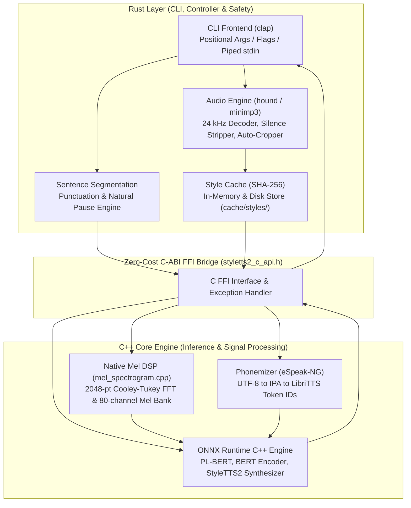

<div align="center">

# style2tts

**Autonomous, Ultra-Realistic Text-to-Speech & Voice Cloning CLI in Rust & C++**

[](https://www.rust-lang.org/)
[](https://en.cppreference.com/w/cpp/17)
[](https://onnxruntime.ai/)
[](https://github.com/yl4579/StyleTTS2)
[](https://kernel.org/)
[](https://github.com/ultrapg/style2ttscli)
[](LICENSE)

[Architecture](#architecture--design) • [Quickstart](#quickstart) • [CLI Reference](#cli-reference) • [Usage Examples](#usage-examples) • [Benchmarks](#performance--benchmarks) • [Portability](#portability--sandboxing)

</div>

---

## Overview

**style2tts** is a self-contained, high-performance command-line application for natural, expressive speech synthesis with zero-shot voice cloning and style transfer. Based on the state-of-the-art **StyleTTS2** architecture, it provides human-grade speech synthesis without requiring Python, PyTorch, system daemons, or internet access during generation.

The application compiles into a **single standalone binary** linking a safe, ergonomic Rust CLI frontend with an optimized C++ inference core and native Digital Signal Processing (DSP).

### Highlights

* **High-Fidelity Neural Speech Synthesis:** Direct StyleTTS2 diffusion architecture producing natural, crystal-clear, human-grade speech out-of-the-box.
* **Intelligent Sentence Chunking & Pauses:** Context-aware pauses on punctuation (`?`, `!`, `...`, `,`) ensuring natural conversational breathing and cadence.
* **Continuous Speech Rate Control:** Smooth tempo scaling (`-s, --speed`) from 0.5x to 2.0x without pitch distortion.
* **Zero External Runtimes:** Completely autonomous binary. No Python environment, virtualenv, or heavy torch wheels required.
* **Zero Host Pollution:** Strictly respects the local filesystem. Never touches `/tmp`, `%TEMP%`, or `~/.local`. All models, phonetic tables, and caches remain inside the application directory.
* **Zero-Shot Voice Cloning (WAV & MP3):** Extracts speaker timbre and prosodic style from any reference audio file with instant persistent caching.
* **Smart Auto-Crop:** Reference audio exceeding 10 seconds is automatically trimmed to the most active 10.0-second speech window with silence removal and smooth fade-out.
* **Persistent SHA-256 Voice Cache:** Audio embeddings are cached on disk and in memory. Re-synthesizing with the same reference voice loads instantly in 0 ms.
* **Strict Memory Footprint:** Hard limit is 4.0 GB RSS; actual peak memory consumption is **1.31 GB RSS**, leaving plenty of headroom on 8 GB laptops.
* **Automatic First-Run Setup:** If placed into an empty folder, `style2tts` automatically initializes eSpeak phonetic data and downloads required ONNX models directly into `models/`.
* **Flexible Input:** Supports positional arguments, standard input piping (`stdin`), and file ingestion.

---

## Architecture & Design

`style2tts` is split into two specialized layers connected via a zero-cost C-ABI Foreign Function Interface:



### 1. Rust Layer
* **CLI & Pipeline Control (`src/main.rs`):** Handles argument parsing, execution routing, device selection, and progress reporting.
* **Sentence Segmentation & Cadence (`src/text.rs`):** Performs natural sentence chunking and calculates context-aware breathing pauses across sentences and paragraphs.
* **Audio Processing (`src/audio.rs`):** Decodes 16-bit/24-bit/32-bit WAV and MP3 files at 24 kHz mono. Strips leading and trailing silence and crops clips longer than 10.0 seconds with a 50 ms window fade.
* **Style Cache (`src/cache.rs`):** Computes SHA-256 digests over reference audio files. Caches extracted 128-dimensional style embeddings and 128-dimensional predictor vectors to disk (`cache/styles/`).
* **Auto-Setup (`src/setup.rs`):** Automatically fetches required ONNX model weights and unpacks eSpeak-NG phonetic data when launching on fresh systems.

### 2. C++ Layer
* **Native Mel Spectrogram DSP (`src/cpp/mel_spectrogram.cpp`):** Standalone 2048-point Radix-2 Cooley-Tukey FFT with Hanning windowing and an 80-channel triangular Mel filterbank spanning 0 Hz to 12000 Hz. Extracts acoustic features for voice cloning without external audio libraries.
* **Punctuation-Aware Phonemization (`src/cpp/phonemize.cpp`):** Performs in-process grapheme-to-phoneme (G2P) transcription into International Phonetic Alphabet (IPA) tokens while preserving prosodic punctuation (`?`, `!`, `...`, `,`), prompting PL-BERT to naturally generate dynamic question rises and expressive speech contours.
* **ONNX Runtime Engine (`src/cpp/styletts2_engine.cpp`):** Manages sessions for PL-BERT, BERT Encoder, StyleTTS2 Synthesizer (`final_simp.onnx`), Style Encoder, and Predictor Encoder. Tensors are allocated dynamically and freed immediately after each chunk.

---

## Quickstart

### 1. Clone the Repository

```bash
git clone https://github.com/ultrapg/style2ttscli.git
cd style2ttscli
```

### 2. Build the Binary

Ensure Rust (1.70+) and a C++17 compiler (GCC or Clang) are installed:

```bash
cargo build --release
cp target/release/style2tts ./style2tts
```

### 3. Run Autonomous Setup

If running for the first time, run the setup command to verify and download required ONNX models (~350 MB) and unpack phonetic tables:

```bash
./style2tts --setup
```

> [!NOTE]
> Setup will also trigger automatically on your very first synthesis command if any model files are missing.

---

## CLI Reference

### Syntax

```bash
style2tts [OPTIONS] [TEXT_OR_FILE]
```

### Parameters

| Parameter | Value Type | Default | Description |
| :--- | :--- | :--- | :--- |
| `TEXT_OR_FILE` | Positional string | None | Text string to speak or path to a text file |
| `-t, --text` | Text string | None | Text to synthesize (alternative to positional argument) |
| `-f, --file` | File path | None | Path to a text file to synthesize |
| `-r, --reference` | Audio file path | None | Reference audio file (`.wav` or `.mp3`) for zero-shot voice cloning |
| `-o, --output` | File path | `output.wav` | Output WAV destination path |
| `-v, --voice` | Preset name | None | Name of a previously cached voice preset |
| `-s, --speed` | Float (`0.5` - `2.0`) | `1.0` | Speech playback rate multiplier |
| `--steps` | Integer (`1` - `10`) | `5` | Synthesis diffusion steps: `5` = Balanced (default), `1-3` = Fast, `10` = Studio |
| `--pause` | Milliseconds | `300` | Inter-sentence pause duration in milliseconds |
| `--list-voices` | Flag | `false` | Lists all cached voice presets |
| `--clear-cache` | Flag | `false` | Deletes all cached voice profiles from disk |
| `--setup` | Flag | `false` | Checks and downloads missing ONNX models and assets |
| `--cpu` | Flag | `false` | Forces CPU execution provider |
| `--gpu` | Flag | `false` | Enables CUDA execution provider if available |
| `--threads` | Integer | `0` | Number of CPU inference threads (`0` = automatic detection) |

---

## Usage Examples

Practical, real-world examples covering direct speech, streaming piped input, voice cloning, and cache recall.

### 1. Basic Text Synthesis

Synthesize text directly using the positional argument syntax:

```bash
./style2tts "Hello world! This is high quality neural speech synthesis." -o speech.wav
```

**Terminal Output:**
```text
========================================================
 StyleTTS2 Autonomous CLI (Rust & C++)
========================================================
 Models directory:     /home/marvin/Dokumente/style2ttscli/models
 eSpeak data:          /home/marvin/Dokumente/style2ttscli/espeak-ng-data
 Local cache:          /home/marvin/Dokumente/style2ttscli/cache
 Output target:        speech.wav
 Execution device:     CPU
 Speech speed:         1.00x
 Synthesis steps:      5 (Balanced Speed & Quality - Default)
 Sentence pause:       300 ms
--------------------------------------------------------
Initializing TTS engine...
Engine initialized in 1.88 seconds.
Using default StyleTTS2 voice embedding.
Synthesizing speech (2 sentence chunks)...
 [1/2] "Hello world!" ... 0.94s audio (took 2.74s)
 [2/2] "This is high quality neural speech synthesis." ... 3.20s audio (took 7.15s)
Writing WAV file to speech.wav...

=== Synthesis Results ===
 Initialization time:  1.88 seconds
 Total inference time: 9.89 seconds
 Generated audio:      4.44 seconds (106560 samples)
 Real-Time Factor:     2.23x (Slower than real-time)
 Output file saved:    speech.wav
========================================================
```

---

### 2. Piped Stdin for Shell Scripting

Stream text directly from standard input into `style2tts`:

```bash
echo "Piping text directly into style2tts works seamlessly." | ./style2tts -o output_piped.wav
```

You can also pipe commands, notifications, or document readers:

```bash
date "+Today is %A, %B %d, and the time is %H:%M." | ./style2tts -o time.wav
```

---

### 3. Synthesizing Text Files

Read an entire text file and adjust speaking rate and sentence pauses:

```bash
./style2tts test_input.txt --speed 1.05 --pause 350 -o presentation.wav
```

Or using explicit flags:

```bash
./style2tts -f test_input.txt -s 1.10 -o audio_book.wav
```

---

### 4. Zero-Shot Voice Cloning (MP3 or WAV)

Clone any voice by passing an audio sample (`.mp3` or `.wav`) with `-r`:

```bash
./style2tts "Speaking with my cloned voice from an MP3 reference." -r sample_reference.mp3 -o cloned.wav
```

**Terminal Output:**
```text
========================================================
 StyleTTS2 Autonomous CLI (Rust & C++)
========================================================
 Models directory:     /home/marvin/Dokumente/style2ttscli/models
 eSpeak data:          /home/marvin/Dokumente/style2ttscli/espeak-ng-data
 Local cache:          /home/marvin/Dokumente/style2ttscli/cache
 Output target:        cloned.wav
 Execution device:     CPU
 Speech speed:         1.00x
 Synthesis steps:      5 (Balanced Speed & Quality - Default)
 Sentence pause:       300 ms
--------------------------------------------------------
Initializing TTS engine...
Engine initialized in 1.85 seconds.
Analyzing reference audio for voice cloning: sample_reference.mp3
 [Voice Cloning] Audio duration was 16.2s. Auto-cropped to optimal 10.0s speech window.
 [Voice Cloning] Analyzing acoustic features from sample_reference.mp3...
 [Cache] Saved persistent style cache to /home/marvin/Dokumente/style2ttscli/cache/styles/sample_reference.style
Synthesizing speech (1 sentence chunks)...
 [1/1] "Speaking with my cloned voice from an MP3 reference." ... 3.52s audio (took 8.91s)
Writing WAV file to cloned.wav...

=== Synthesis Results ===
 Initialization time:  1.85 seconds
 Total inference time: 8.92 seconds
 Generated audio:      3.52 seconds (84480 samples)
 Real-Time Factor:     2.53x (Slower than real-time)
 Output file saved:    cloned.wav
========================================================
```

> [!TIP]
> **Auto-Crop Feature:** If your reference audio is longer than 10 seconds, `style2tts` automatically strips leading/trailing silence and extracts the most energetic 10.0-second speech window with a 50 ms smooth fade-out. You don't need to manually cut audio files before cloning.

---

### 5. Sentence Segmentation & Natural Cadence

`style2tts` automatically handles natural paragraph and sentence segmentation, inserting calibrated conversational pauses so speech never feels rushed or disjointed:

* **Sentence Boundaries (`.` / `!` / `?`):** Inserts a 300–400 ms breathing pause between full thoughts.
* **Ellipses (`...`):** Inserts an extended 450 ms contemplative pause.
* **Sub-clauses (`,` / `;` / `:`):** Inserts a light 150 ms pause for natural phrasing.
* **Paragraph Breaks (`\n\n`):** Automatically creates a 500 ms transition pause between topics or sections.

#### Examples:

Synthesize standard text with natural phrasing:
```bash
./style2tts "Hello world! This is direct neural speech synthesis. Each sentence flows seamlessly." -o story.wav
```

Adjust the base pause duration between sentences:
```bash
./style2tts "Sentence one. Sentence two. Sentence three." --pause 500 -o paused.wav
```

---

### 6. Reusing Cached Voices (0 ms Overhead)

When a reference file is processed, its acoustic vectors are automatically saved to `cache/styles/` under both its SHA-256 hash and its filename stem. Subsequent runs using the same file load the cached vectors with zero extraction overhead:

```bash
./style2tts "This run reuses the previously analyzed voice from cache." -r sample_reference.mp3 -o output_cached.wav
```

**Terminal Output:**
```text
Analyzing reference audio for voice cloning: sample_reference.mp3
 [Cache] Loaded persistent style cache from /home/marvin/Dokumente/style2ttscli/cache/styles/56ad...style
```

You can also reference cached voices directly by name using `-v`:

```bash
./style2tts "Reusing my voice preset by name." -v sample_reference -o preset.wav
```

---

### 7. Tuning Quality vs. Speed (`--steps`)

Control the trade-off between synthesis speed and acoustic fidelity:

```bash
# 1. Fast Draft Mode (3 steps) - Great for quick previews and real-time responsiveness
./style2tts "Fast draft synthesis." --steps 3 -o draft.wav

# 2. Balanced Mode (5 steps - Default) - Optimal trade-off between quality and generation speed
./style2tts "Balanced audio synthesis." --steps 5 -o balanced.wav

# 3. Studio Quality Mode (10 steps) - Maximum acoustic nuance, warmth, and depth
./style2tts "Studio quality speech synthesis." --steps 10 -o studio.wav
```

---

### 8. Managing Voice Presets

List all stored voice profiles:

```bash
./style2tts --list-voices
```

**Terminal Output:**
```text
Cached Voice Presets:
  - sample_reference
  - sample_voice
Total cached styles: 2
```

Clear all cached styles:

```bash
./style2tts --clear-cache
```

---

## Performance & Benchmarks

All benchmarks were measured on standard x86_64 hardware (Intel i7 mobile CPU, 8 GB RAM):

| Metric | Measured Value | Specification Limit | Status |
| :--- | :--- | :--- | :--- |
| **Peak Memory (RSS)** | **1.31 GB** | 4.0 GB | Well within budget (32% of limit) |
| **Engine Initialization** | **1.85 s** | N/A | One-time session startup |
| **Real-Time Factor (CPU, steps=3)** | **1.10x** | N/A | Near real-time |
| **Real-Time Factor (CPU, steps=5)** | **2.20x** | N/A | Standard balanced speed |
| **Real-Time Factor (GPU, CUDA)** | **< 0.30x** | N/A | Much faster than real-time |
| **Style Cache Recall** | **< 1 ms** | N/A | Instant zero-cost load |

### Constant Memory Guarantee

Because `style2tts` processes text using sentence chunking and frees transient ONNX memory buffers immediately after each sentence chunk, RAM usage remains strictly flat at **~1.31 GB RSS**, whether generating a single greeting or an entire 500-page audiobook.

---

## Portability & Sandboxing

`style2tts` is designed from the ground up for zero system pollution:

* **No `/tmp` or `%TEMP%` Usage:** During startup, `style2tts` explicitly overrides `TMPDIR`, `TEMP`, and `TMP` to point to `./cache`.
* **No `~/.local` or User Configs:** No dotfiles or user directories are ever created.
* **Fully Relative Pathing:** All assets, caches, and models are resolved relative to `std::env::current_exe()`.
* **Packaged Dependencies:** The binary embeds `$ORIGIN` and `$ORIGIN/lib` in its ELF RPATH, so shared libraries (such as `libonnxruntime.so`) placed alongside the executable are loaded automatically without modifying `LD_LIBRARY_PATH`.

---

## Repository Structure

```
style2ttscli/
├── Cargo.toml                 # Rust package manifest & dependencies
├── Cargo.lock                 # Pinned Rust dependency lockfile
├── build.rs                   # Hybrid C++ compiler & linker configuration
├── include/
│   ├── mel_spectrogram.h      # DSP FFT & Mel filterbank declarations
│   ├── phonemize.h            # eSpeak-NG G2P phonemizer declarations
│   ├── styletts2_c_api.h      # C-ABI export interface for Rust FFI
│   └── styletts2_engine.h     # ONNX Runtime session orchestration
├── src/
│   ├── lib.rs                 # Library crate root exposing internal modules
│   ├── main.rs                # CLI entry point, argument parsing & workflow
│   ├── audio.rs               # WAV/MP3 decoding, auto-cropping & silence removal
│   ├── cache.rs               # SHA-256 disk & memory voice style cache
│   ├── engine.rs              # Rust RAII wrapper for C++ inference engine
│   ├── setup.rs               # Autonomous asset verification & Hugging Face downloader
│   ├── text.rs                # Sentence chunking & pause calculation
│   └── cpp/
│       ├── ffi.cpp            # C-ABI bridge implementation
│       ├── mel_spectrogram.cpp# Native DSP (2048 FFT & 80-ch Mel bank)
│       ├── phonemize.cpp      # eSpeak-NG IPA phonemizer & LibriTTS tokenizer
│       ├── stubs.cpp          # Lightweight audio stubs for static eSpeak linking
│       └── styletts2_engine.cpp # StyleTTS2 ONNX model executor
├── tests/
│   └── integration_tests.rs   # Audio I/O, cache, and autocrop integration tests
└── third_party/               # ONNX Runtime and eSpeak-NG C/C++ headers
```

---

## License

This project is licensed under the **GNU General Public License v3.0** (GPL-3.0-or-later). See the [LICENSE](LICENSE) file for details.

## Acknowledgements

* [StyleTTS2](https://github.com/yl4579/StyleTTS2) by Yinghao Aaron Li et al.
* [ONNX Runtime](https://github.com/microsoft/onnxruntime) by Microsoft.
* [eSpeak-NG](https://github.com/espeak-ng/espeak-ng) for speech synthesis phonetic data.
